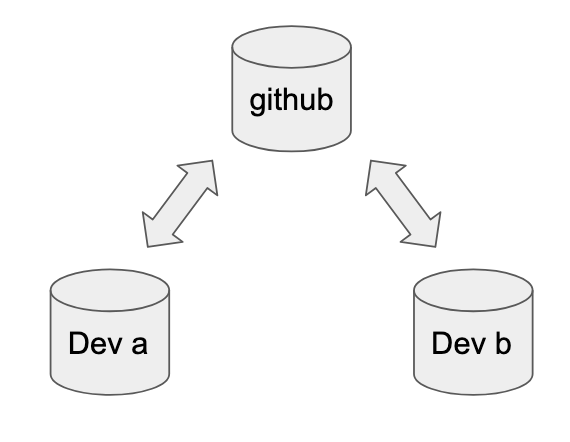
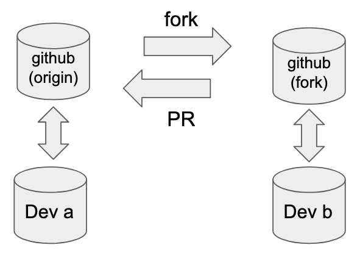

# Collaborative Code Development Models

::left::

::center
Shared repository model
(common in private projects)

::

::right::

::center
Fork and pull model
(popular in open source)

::

---

# Collaborative project

(github collaborative project url)

 

(this is a structured repo where attendees will submit their own code [small function] via a pull request to see the PR / code review process)

---
layout: instruction
---

# Pull Requests

::left::

::center
Pull Request
::

::right::

Instructor demo / follow-along:
- Fork repository
- Open in codespaces (git clone)
- Create a feature branch

Instructor demo:
- Submit a Pull Request

Task:
- Add a file containing a function
- Submit a Pull Request

---
layout: two-cols-header
class: "gap-4"
---

# Advantages of Code Review

::left::

- Identifies defects early in the process
- Cost-effective error removal
- Enhances team learning and collaboration
- Improves overall team software development process

::right::

---
layout: instruction
---

# Pull Requests

::left::

::center
Code Review
::

::right::

Instructor demo:
- Code Review

Task:
- Add a test function *in the same feature branch*, testing locally to ensure that it passes before commiting
- Navigate to your pull request, notice that your PR has been updated with your test code

---
layout: instruction
---

# Pull Requests

::left::

::center
Clone and test manually
::

::right::

Instructor demo:
- Check tests in another repository

---

# Automation and Collaborative Coding

- Project management with Github
- Collaborative Coding
- **Continuous Integration**
- Workflow managers
