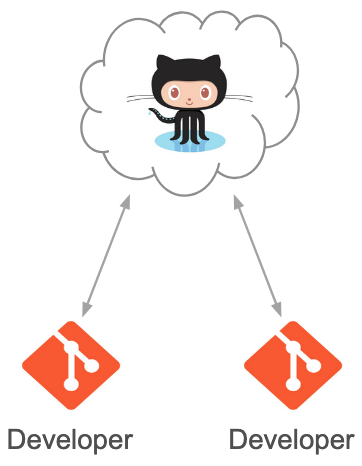
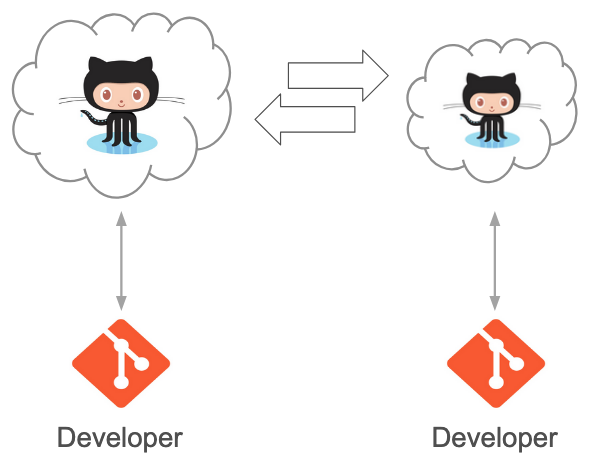
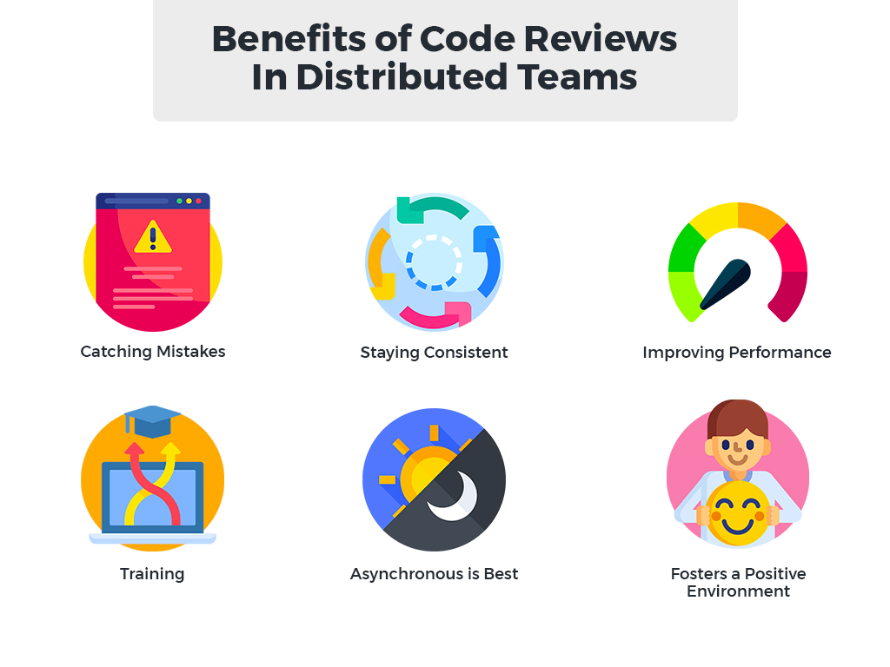

# Collaborative Code Development Models

::left::

::center

Shared repository model<br />
(common in private projects)

<div class="h-4" />

::

::right::

::center

<div v-click>

Fork and pull model<br />
(popular in open source)

<div class="h-4" />


</div>
::

---

# Collaborative project

### ZooShowcase

https://github.com/OxfordRSE/softeng-daycourse-zoo

Add an animal to the zoo. Copy (and modify) one of the existing animals (e.g. `src/zoo/elephant.py`) to create a new animal (e.g. `src/zoo/kangaroo.py`).

```python
# src/zoo/kangaroo.py
from animal import Animal

class Kangaroo(Animal):
    def __init__(self, name="Roo"):
        super().__init__(name, species="Kangaroo")

    def sound(self):
        return "thumps"

    def action(self):
        return "hops around happily."
```

---
layout: instruction
---

# Github

::left::

::center
Pull Request
::

::right::

Instructor demo / follow-along:
- Fork repository<br />
  <small>[github.com/OxfordRSE/softeng-daycourse-zoo](https://github.com/OxfordRSE/softeng-daycourse-zoo)</small>
- Open in codespaces (git clone)
- Create a feature branch

Instructor demo:
- Submit a Pull Request

Task:
- Add a file containing a function
- Submit a Pull Request

---
layout: two-cols-header
class: "gap-4"
---

# Advantages of Code Review

::left::

- Identifies defects early in the process
- Cost-effective error removal
- Enhances team learning and collaboration
- Improves overall team software development process

::right::

<div class="h-4" />


---
layout: instruction
---

# Pull Requests

::left::

::center
Code Review
::

::right::

Instructor demo:
- Code Review

Task:
- Add a test function *in the same feature branch*, testing locally to ensure that it passes before commiting
- Navigate to your pull request, notice that your PR has been updated with your test code

---
layout: instruction
---

# Pull Requests

::left::

::center
Clone and test manually
::

::right::

Instructor demo:
- Check tests in another repository
