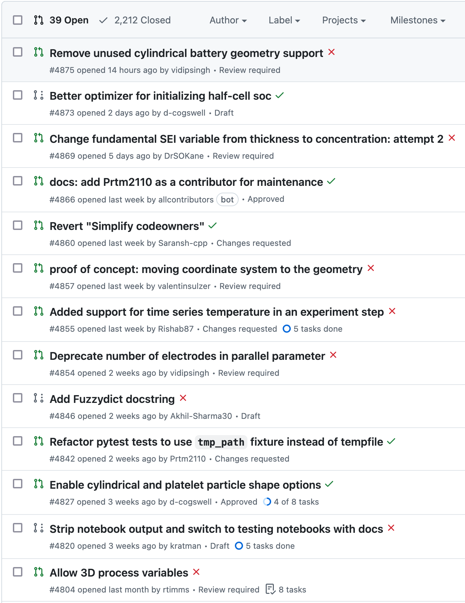

# Introduction to Continuous Integration (CI)

- **Definition**: Continuous Integration (CI) is an automated process for verifying and integrating code changes.
- **Objective**: To detect and resolve issues early by frequently testing and integrating code changes.
- **Importance**: Ensures compatibility, functionality, and reduces the introduction of unexpected problems.

---

# Challenges Without CI

- **Compatibility**: Ensuring code works across various OS, software versions, and hardware.
- **Consistency**: Avoiding dependencies on specific user data or development machine configurations.
- **Collaboration**: Managing code changes in tandem with other developers without conflict.

---

# Key Principles of CI

- **Single Source Repository**: Maintain all code and dependencies in a shared repository.
- **Automate the Build**: Automatically compile, package, and create installers for code.
- **Self-testing Builds**: Employ automated tests to validate code functionality post-build.

---

# Key Principles of CI (Continued)

- **Frequent Commits**: Developers integrate their changes regularly to avoid complex conflicts.
- **Integration Machine**: Ensure builds and tests are conducted in a standardised, clean environment.
- **Visibility and Transparency**: Ensure all build and test results are accessible to the entire team.

---

# Continuous Integration Tools


**GitHub Actions**: A CI/CD tool within GitHub’s platform.


**Travis CI**: A popular CI service used in various open-source projects.


**AppVeyor**: CI/CD tool that allows building, testing, and deploying applications.

*Note*: Each tool has unique and common features. Exploring multiple options is advised.

---

# Benefits of Implementing CI

- **Efficiency**: Swift detection and resolution of integration issues.
- **Quality Assurance**: Automated tests and builds ensure code quality and functionality.
- **Reproducibility**: Standardised and automated build/deploy processes ensure consistent output.

---
layout: instruction
---

# Continuous Integration

::left::

::center

::

<div class="absolute top-43 left-70 w-47 border border-color-black">

</div>

::right::

Follow-along:
- Add continuous integration to the repository (*Action: “Python Application” [flake8, pytest]*)
- Submit another pull request for your feature branch to your own main branch
- Add commits to the feature branch that first break, then fix the tests
- Explore Action reports

---
layout: two-cols-header
class: "gap-4"
---

# Platform support?

::left::

::center
“… density functional theory nuclear magnetic resonance calculations established the relative configurations of compounds 1 and 2 and revealed that the calculated shifts **depended on the operating system** when using the “Willoughby–Hoye” Python scripts to streamline the processing of the output files, a previously unrecognized flaw that could lead to incorrect conclusions.”
::

<div class="absolute border border-color-black top-95 left-27 w-80 p-4 text-center">
The issue was due to
<b>different sorting of file names</b>
on <b>different operating systems</b>
</div>

::right::

::center

::

<div class="h-4" />

::center
<div class="text-sm">
Organic Letters, October 8 2019<br>
https://doi.org/10.1021/acs.orglett.9b03216
</div>
::

---
layout: instruction
---

# Continuous Integration

::left::

<div class="text-sm">
<i>Example:</i>
</div>

<div class="text-sm w-full max-w-[80%] mx-auto leading-none table-tight">

| | ubuntu | windows | macos |
|--|:--:|:--:|:--:|
| python 3.9 | ❌ | ❌ | ❌ |
| python 3.10 | ✅ | ❌ | ✅ |
| python 3.11 | ✅ | ❌ | ✅ |
| python 3.12 | ✅ | ❌ | ✅ |

<div class="h-5" />

</div>

```yaml
jobs:
  build:
    runs-on: ${{ matrix.os }}
    strategy:
        matrix:
            os: [ubuntu-latest, windows-latest, macos-latest]
            python-version: [3.9, 3.10, 3.11, 3.12]
```

<div class="absolute border border-gray-400 left-85 top-90">
```yaml
on:
  workflow_dispatch:
```
</div>

::right::

Task:
- Add test matrix
- Re-run tests

---

# Documentation

**Sphinx** - Build HTML documents from structured text (e.g. markdown, reST)

**ReadTheDocs** - Hosts HTML documents

<div class="h-4" />

:: center
For example:

https://github.com/globaldothealth/InsightBoard
::

<div class="h-4" />

Changes to the documentation (or code) can trigger documentation builds

---

# Documents

**GitHub Pages** - Host static HTML documents

Host documents on GitHub and publish them on GitHub Pages

<div class="h-8" />

:: center
These slides are hosted on GitHub Pages!

https://github.com/OxfordRSE/softeng-daycourse
::

---


# Publish Python packages

Automatically publish to the Python Package Index (PyPI)
<br /><br /><br />

<div class="h-4" />

:: center
For example:

https://github.com/pybamm-team/PyBaMM
::

---

# Application builds

Triggered builds of Windows / MacOS / Linux applications
<br /><br /><br />

<div class="h-4" />

:: center
For example:

https://github.com/kraemer-lab/GRAPEVNE/releases
::
