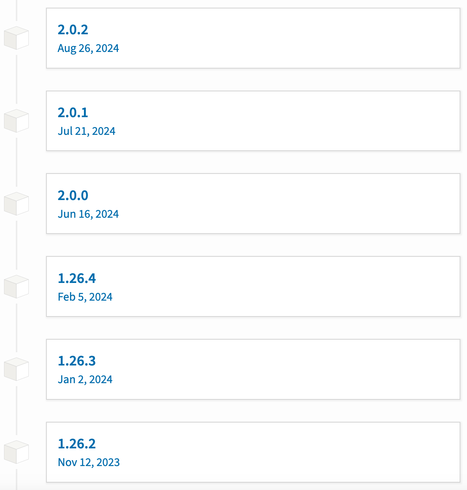

# Dependency management

::left::

```python
import numpy as np

def main():
    ...
```

::center
<br><br>
*<v-click>Which version of numpy?</v-click>*
::

::right::



---
layout: two-cols-header
leftClass: "items-center justify-center gap-10"
rightClass: "items-center justify-center gap-10"
---

# Dependency management

::left::

<div class="flex flex-col items-center">
<b>Semantic versioning (SemVer)</b><br>
<small>API stability, communication, dependency management</small>
</div>

<div class="flex flex-col items-center">
<b>Calendar versioning (CalVer)</b><br>
<small>Regular releases, simplicity</small>
</div>

::right::

<div class="flex flex-col items-center">
<b>4.3.1</b><br>
<small>(major.minor.patch)</small>
</div>

<div class="flex flex-col items-center">
<b>2025.01</b><br>
<small>(year.month)</small>
</div>

---
layout: two-cols-header
---

# Dependency management

::left::

```python
import numpy as np

def main():
    ...
```

::right::


<v-click>
  <FancyArrow
    x1="400"
    y1="270"
    x2="535"
    y2="324"
    arc="-0.2"
    head-size="20"
    v-click="1"
  />
</v-click>

---

# Dependency management

<div style="position: absolute; top: 100, left: 100; width: 100; height: 100;">

</div>

<div class="h-10"></div>

::center

**numpy** is a top-20 downloaded package on PyPI<br>
which in June 2024 released a new major version.

Numpy v1 and v2 were no longer entirely compatible.

The official release notes included the phrase:

_“This major release includes <span v-mark.circle.red="1">breaking changes</span>…<br>
including an ABI break …<br>
and API changes …”_

<!--
In the example given an informative error is provided to the user. However, some changes may be more surruptitious, such as rules over type promotion (float32 may be returned instead of float64 now when mixing types in expressions).
-->

::

---
layout: "three-cols-header"
layoutClass: "gap-4"
leftClass: "items-center justify-center"
middleClass: "items-center justify-center"
rightClass: "items-center justify-center"
transition: "none"
---

# Version conflict

::left::

<div class="flex flex-col items-center gap-0 p-4">
  <p><b>Software A</b></p>
  <p>numpy v1</p>
  <p>Python 3.7</p>
</div>

::middle::


::right::

<div class="flex flex-col items-center gap-0 p-4">
  <p><b>Software B</b></p>
  <p>numpy v2</p>
  <p>Python 3.13</p>
</div>

---
layout: "three-cols-header"
layoutClass: "gap-4"
leftClass: "items-center justify-center"
middleClass: "items-center justify-center"
rightClass: "items-center justify-center"
---

# Version conflict

::left::

<div class="flex flex-col items-center gap-0 bg-blue-50 dark:bg-blue-800 border border-black dark:border-white rounded-xl p-4">
  <p><b>Software A</b></p>
  <p>numpy v1</p>
  <p>Python 3.7</p>
</div>

::middle::


::right::

<div class="flex flex-col items-center gap-0 bg-green-50 dark:bg-green-800 border border-black dark:border-white rounded-xl p-4">
  <p><b>Software B</b></p>
  <p>numpy v2</p>
  <p>Python 3.13</p>
</div>

---

# Virtualisation

<div style="position: relative; top: 40px; width: 100%; height: auto; margin: auto;">

  <div class="flex flex-col items-center space-y-1">
    <div class="flex space-x-1">
      <span v-mark.circle.red="8">
        <div class="w-40 h-20 bg-yellow-500 text-white flex items-center justify-center rounded" v-click="0">venv</div>
      </span>
    </div>
    <div class="flex space-x-1">
      <div class="w-80 h-20 bg-amber-500 text-white flex items-center justify-center rounded" v-click="2">conda</div>
    </div>
    <div class="flex space-x-1">
      <div class="w-120 h-20 bg-orange-500 text-white flex items-center justify-center rounded" v-click="4">Container</div>
    </div>
    <div class="flex space-x-1">
      <div class="w-160 h-20 bg-red-500 text-white flex items-center justify-center rounded" v-click="6">Virtual Machine</div>
    </div>
  </div>
  
  <div class="absolute top--10 right-25" v-click="1">
    Python & packages
  </div>
  
  <FancyArrow
    x1="673"
    y1="-10"
    x2="525"
    y2="40"
    arc="0.2"
    head-size="20"
    v-click="1"
  />
  
  <div class="absolute top-12 left-10" v-click="3">
    General software
  </div>
  
  <FancyArrow
    x1="110"
    y1="75"
    x2="265"
    y2="125"
    arc="-0.2"
    head-size="20"
    v-click="3"
  />
  
  <div class="absolute top-33 right--6" v-click="5">
    Environment
  </div>
  
  <FancyArrow
    x1="835"
    y1="160"
    x2="685"
    y2="210"
    arc="0.2"
    head-size="20"
    v-click="5"
  />
  
  <div class="absolute top-55 left--8.5" v-click="7">
    System
  </div>
  
  <FancyArrow
    x1="0"
    y1="245"
    x2="110"
    y2="295"
    arc="-0.2"
    head-size="20"
    v-click="7"
  />

</div>

---
layout: instruction
---

# Dependency management

::left::

::center
Numpy v2
::

::right::

Instructor demo / follow-along:

- Create a venv called "`venv_np2`":
  ```bash
  python -m venv venv_np2
  ```
- Activate the venv:
  ```bash
  source venv_np2/bin/activate
  ```
- Install `numpy` <small>(latest version)</small>:
  ```bash
  pip install numpy
  ```
- Run the software:
  ```bash
  python script2023.py          # should fail #
  ```
- Deactivate the venv:
  ```bash
  deactivate
  ```

<!--
The script (that was written in 2023 using numpy v1) now fails.
So how do we get the script to run correctly?
- We can either change the script to be compatible with numpy v2 (time consuming and fragile to future changes), or
- We can create a virtual environment with the correct version of numpy installed.
-->

---
layout: instruction
---

# Dependency management

::left::

::center
Numpy v1
::

::right::

Instructor demo / follow-along:
- Create a venv called "`venv_np1`":
  ```bash
  python -m venv venv_np1
  ```
- Activate the venv:
  ```bash
  source venv_np1/bin/activate
  ```
- Install `numpy` <small>('pin' the version number)</small>:
  ```bash
  pip install "numpy==1.26.4"
  ```
- Run the software:
  ```bash
  python script2023.py        # should succeed #
  ```
- Deactivate the venv:
  ```bash
  deactivate
  ```

---

# Dependency management

<br />

How do we keep a record of our dependencies?

One very simple but effective way is to record them in a `requirements.txt` file:

```text
numpy==1.26.2       # version tagged
pandas<3            # version range
scipy               # unspecified! (latest version)
```

To install the dependencies in a `requirements.txt` file, use the command:
```bash
pip install -r requirements.txt
```

<!--
'-r' indicates a requirements file; although this doesnt have to be named `requirements.txt`, it is a common convention and means that the file is easily identifiable in the project.

requirements.txt is not the best practise but, depending on the complexity of your project, it is a very simple standard solution that works well.

For more complex projects, you would write a pyproject.toml
-->

---
layout: instruction
---

# Dependency management

::left::

::center
Create an environment that allows an old script to run
::

::right::

::small

- Run the script `old_script.py` - it will tell you its requirements.
- Create a `requirements.txt` file to record the dependencies and make it run.

<div class="w-100% color-gray-600 bg-gray-300 dark:color-gray-600 dark:bg-gray-400 rounded">
Outline:
<ul>
  <li>
  Setup and activate a virtual environment:<br />
  <code>python -m venv venv</code><br />
  <code>source venv/bin/activate</code>
  </li>
  <li>
  Create a <code>requirements.txt</code> file with the necessary package list. Install using:<br />
  <code>pip install -r requirements.txt</code><br />
  </li>
  <li>
  Run the software:<br />
  <code>python old_script.py</code><br />
  </li>
  <li>
  Adjust the dependencies and try again. Once the script runs successfully, deactivate the venv:<br />
  <code>deactivate</code>
  </li>
</ul>
</div>

::
