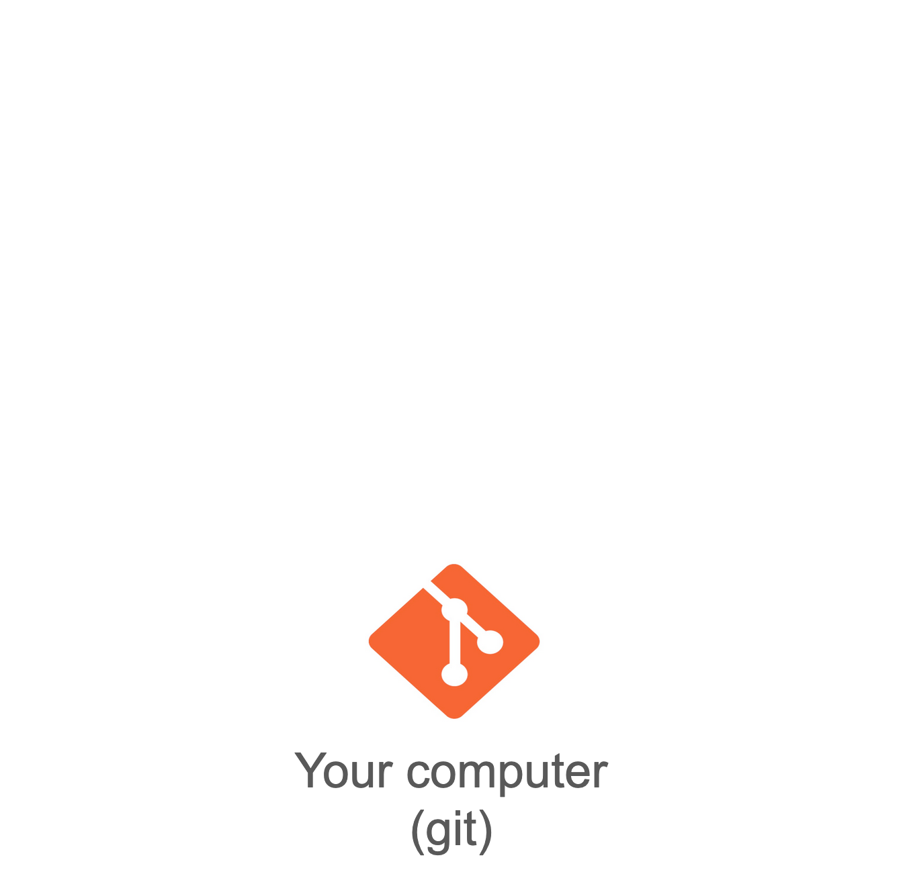
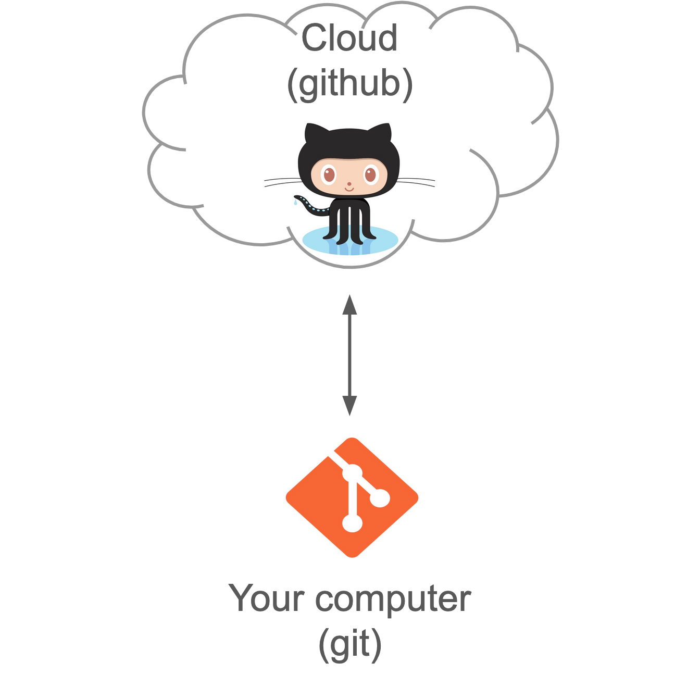
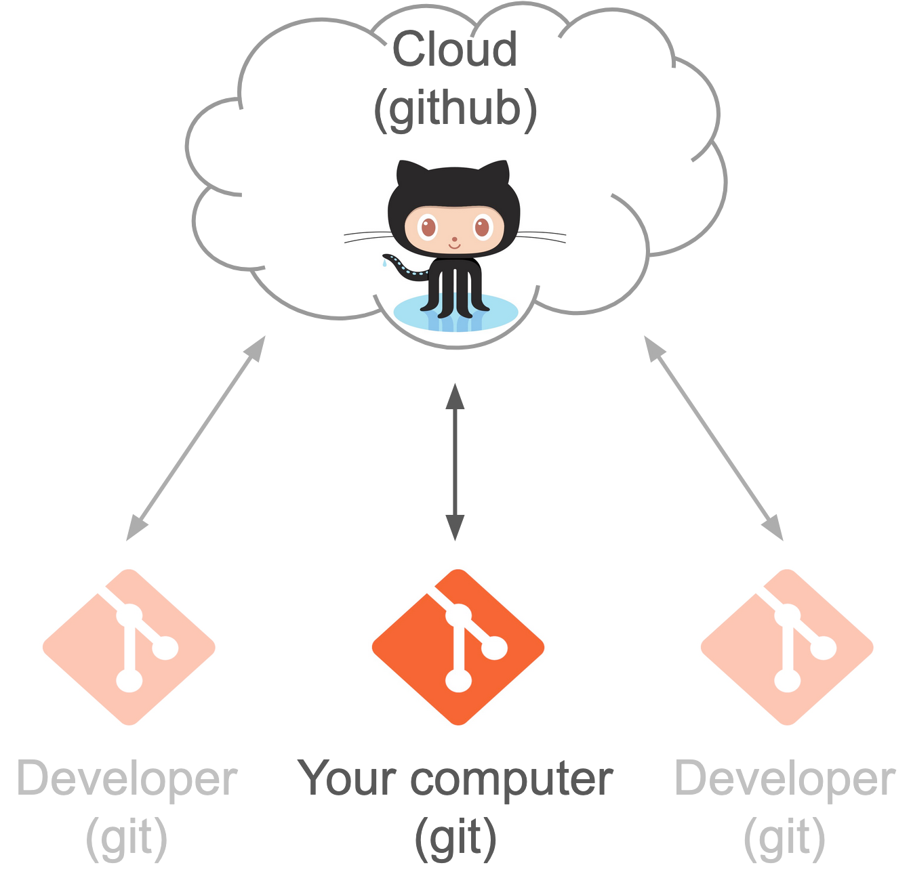
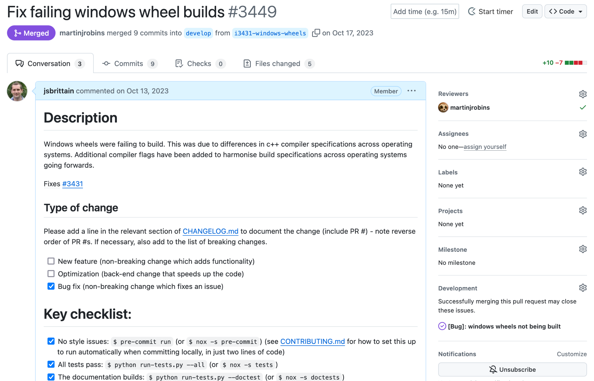
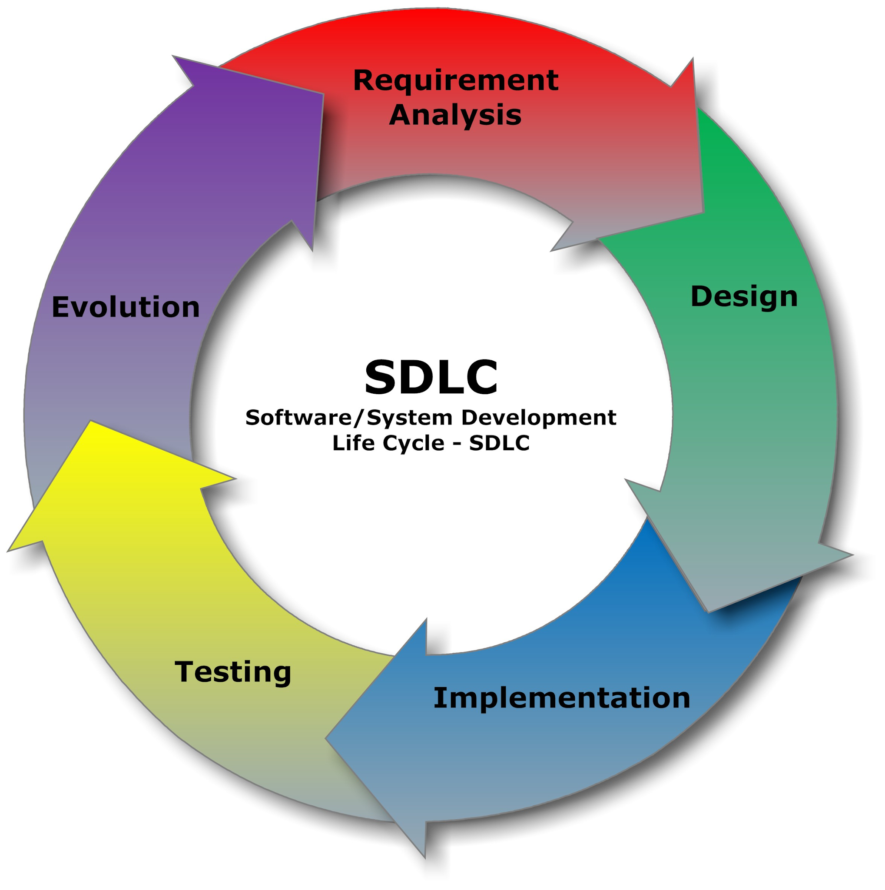
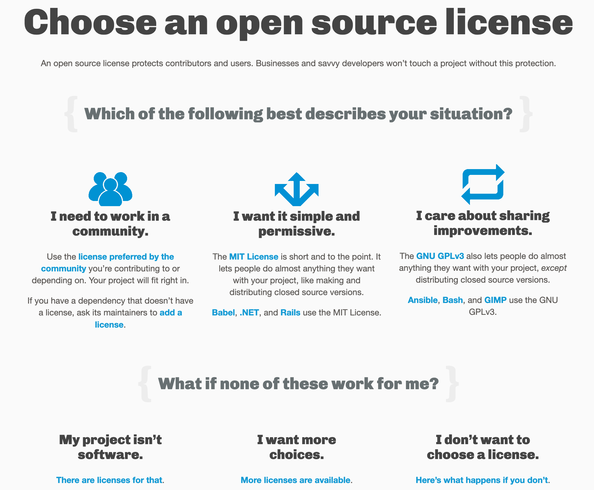
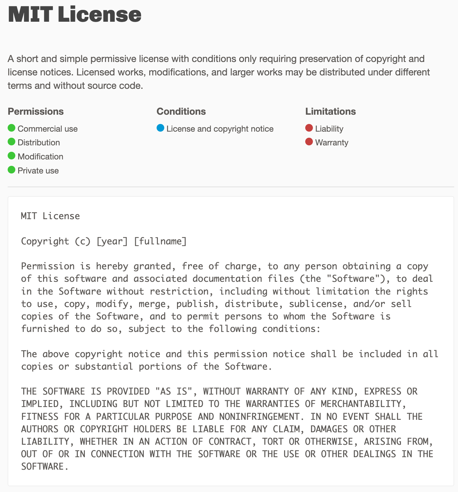

# Collaborative Code Development

::left::

<div class="h-4" />

- Upload version-controlled files to a remote server
- Collaborate with anyone, anywhere in the world
- Share your code openly (or not!)
- Protect yourself from disaster

::right::



---
layout: two-cols-header
transition: none
---

# Collaborative Code Development

::left::

<div class="h-4" />

- Upload version-controlled files to a remote server
- Collaborate with anyone, anywhere in the world
- Share your code openly (or not!)
- Protect yourself from disaster

::right::



---
layout: two-cols-header
---

# Collaborative Code Development

::left::

<div class="h-4" />

- Upload version-controlled files to a remote server
- Collaborate with anyone, anywhere in the world
- Share your code openly (or not!)
- Protect yourself from disaster

::right::



---

# Project Management with GitHub

- Use GitHub Issues for tracking tasks
- Use Mentions for communication and referencing
- Requires a good project and issue management framework

<div class="h-4" />

<div class="flex h-75 gap-4 justify-center">


</div>

<!--
Use this slide to launch into a guided tour of Github
-->

---
layout: two-cols-header
class: "gap-4"
leftClass: "items-center"
rightClass: "items-center"
---

# Beyond building a 'sequence of instructions'

::left::

### Waterfall model

<div class="h-4" />

<div style="position: relative; top: 0px; width: 40%; height: auto; margin: auto;">

  <div class="flex flex-col items-center space-y-3">
    <div class="flex space-x-1">
    <div class="w-60 h-10 bg-yellow-400 text-gray-600 flex items-center justify-center rounded">Requirements Analysis</div>
    </div>
    <div class="flex space-x-1">
      <div class="w-60 h-10 bg-yellow-400 text-gray-600 flex items-center justify-center rounded">Design</div>
    </div>
    <div class="flex space-x-1">
      <div class="w-60 h-10 bg-yellow-400 text-gray-600 flex items-center justify-center rounded">Implementation</div>
    </div>
    <div class="flex space-x-1">
      <div class="w-60 h-10 bg-yellow-400 text-gray-600 flex items-center justify-center rounded">Testing</div>
    </div>
    <div class="flex space-x-1">
      <div class="w-60 h-10 bg-yellow-400 text-gray-600 flex items-center justify-center rounded">Release</div>
    </div>
    <div class="flex space-x-1">
      <div class="w-60 h-10 bg-yellow-400 text-gray-600 flex items-center justify-center rounded">Maintenance</div>
    </div>
  </div>

  <FancyArrow x1="85" y1="40"  x2="85" y2="51"  head-size="8" color="gray" width="1" roughness="1" />
  <FancyArrow x1="85" y1="92"  x2="85" y2="103" head-size="8" color="gray" width="1" roughness="1" />
  <FancyArrow x1="85" y1="144" x2="85" y2="155" head-size="8" color="gray" width="1" roughness="1" />
  <FancyArrow x1="85" y1="196" x2="85" y2="207" head-size="8" color="gray" width="1" roughness="1" />
  <FancyArrow x1="85" y1="248" x2="85" y2="259" head-size="8" color="gray" width="1" roughness="1" />

</div>

::right::

### Agile model

<div class="h-4" />


---

# Licensing

- Open-source *(code is available to download / modify)*
- Create a github repository you are asked to select a license
- Broad categories
  - Permissive (*commercial use, distribution, modification*)
  - Conditions (*disclose source, same license*)
  - Limitations (*liability, warranty*)

---

<style>
.default {
  background-color: #fafafa
}
</style>

# Licensing

::center


[choosealicense.com](https://choosealicense.com/)
::

---

# Licensing

### No license

<div class="h-10" />

- If you find software that doesn’t have a license, that generally means you have **no permission** from the creators of the software to use, modify, or share the software
- Where there are other contributors, they are license holders for their contributions, meaning **you** do not have permission to use, modify or share their contributions
- If hosted on github the authors will have agreed to github’s own Terms of Service which permits others to view and fork your repository (for public repositories)

---

# Licensing

::center

::

---
layout: instruction
---

# Github

::left::

Clone your repository and push changes

::right::

Instructor follow-along:

- Create a new repository (Github interface)
  - Remember to select a license
- Open a [blank Codespace](https://github.com/codespaces) and clone your repository
- Add a file, stage and commit
- Push changes to Github
```bash
git push
```

- Explore commit history (Github interface)
