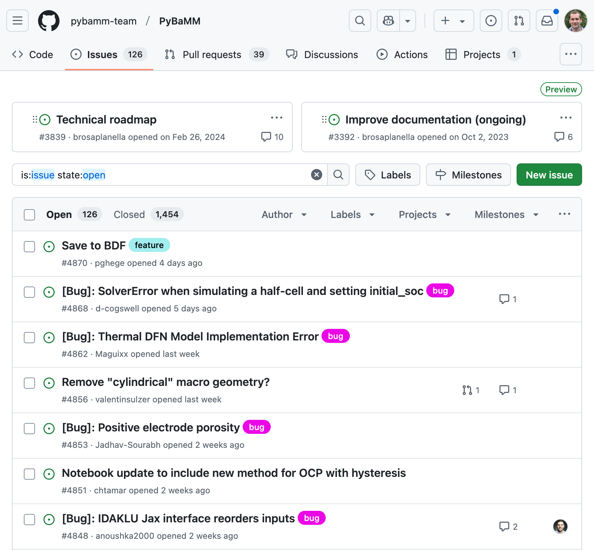

# Collaborative Code Development

::left::

- Upload version-controlled files to a remote server
- Collaborate with anyone, anywhere in the world
- Share your code openly (or not!)
- Protect yourself from disaster

::right::

---
layout: instruction
---

# Github

::left::

::center
Publish to github
::

::right::

Instructor demo / follow-along:
- Publish repository to github
- Brief guided tour of github

---

# Project Management with GitHub

- Use GitHub Issues for tracking tasks
- Use Mentions for communication and referencing
- Requires a good project and issue management framework

---
layout: two-cols-header
class: "gap-4"
leftClass: "items-center"
rightClass: "items-center"
---

# Beyond building a 'sequence of instructions'

::left::

### Waterfall model

Requirements Analysis

Design

Implementation

Testing

Release

Maintenance

::right::

### Agile model

---

# Licensing

- Open-source *(code is available to download / modify)*
- Create a github repository you are asked to select a license
- Broad categories
  - Permissive (*commercial use, distribution, modification*)
  - Conditions (*disclose source, same license*)
  - Limitations (*liability, warranty*)

---

# Licensing

::center

[choosealicense.com](https://choosealicense.com/)
::

---

# Licensing

### No license

- If you find software that doesn’t have a license, that generally means you have **no permission** from the creators of the software to use, modify, or share the software
- Where there are other contributors, they are license holders for their contributions, meaning **you** do not have permission to use, modify or share their contributions
- If hosted on github the authors will have agreed to github’s own Terms of Service which permits others to view and fork your repository (for public repositories)

---

# Licensing

::center

::
