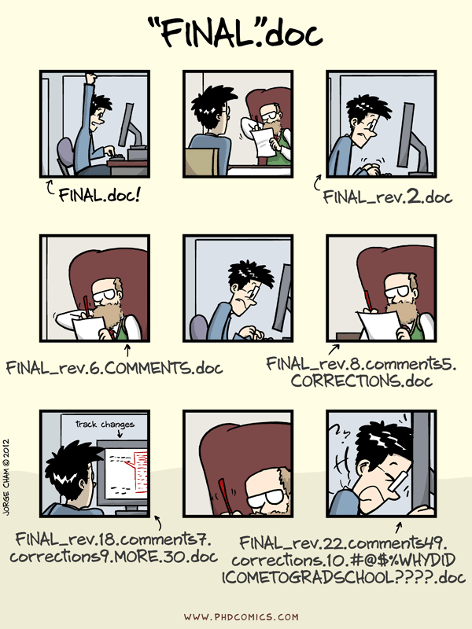
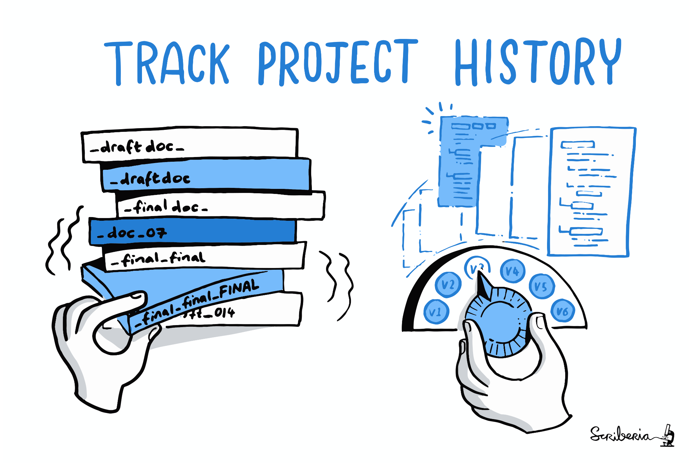
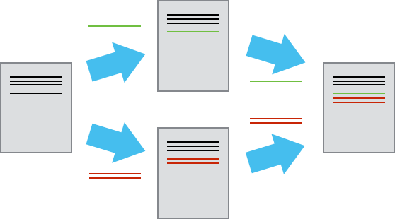
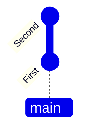
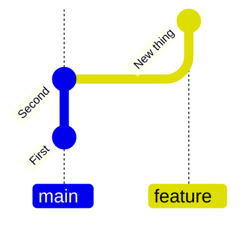
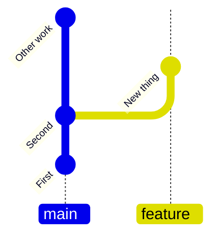
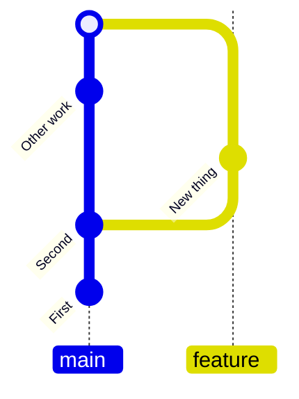
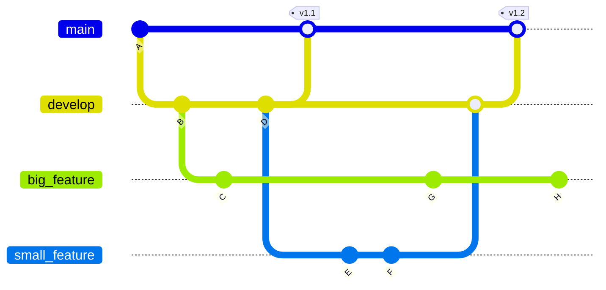
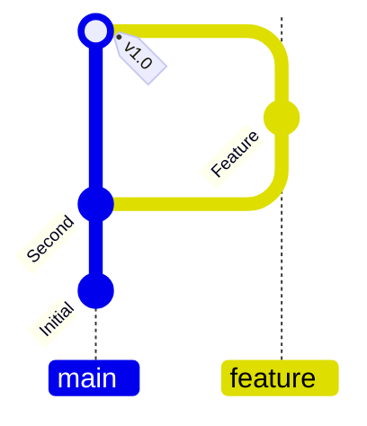

# Code management & collaboration

::left::

- *Version control* provides a full history of your project's software and other assets
- Makes for easy:
  - Backups
  - Collaboration
  - Recovering from dead-ends
- What should be in version control?
  - Code, documentation, tests, test data, analysis scripts
  - Reports, papers, etc.
- Packaging and deployment

::right::

::center

::

---

# Code management & collaboration

::centralise::

::center

<i>“If you’re not using version control,<br>
whatever else you might be doing with a computer,<br>
it’s not science."</i><br>
<br>
Greg Wilson, SWC

::

---

# Version Control

<div class="h-10" />

- These skills will save you time
- Always assume others will use and develop your software
- Be clear on requirements and assume they will change
- Funders are increasingly expecting software outputs to be sustainable and reusable

---

# Version Control Systems

::centralise::

::center
<div class="dark:bg-gray-200 pt-3 w-50%">
  
  <div class="flex w-100% justify-center">
    
    
  </div>
</div>
::

---
layout: two-cols-header
---

# Version Control

::left::

<div class="h-10" />

- **Backup**
- Reproducibility
- Collaboration

::right::



---
layout: two-cols-header
---

# Version Control

::left::

<div class="h-10" />

- Backup
- **Reproducibility**
- Collaboration

::right::

<!--  -->

---
layout: two-cols-header
---

# Version Control

<div class="h-10" />

::left::

- Backup
- Reproducibility
- **Collaboration**

::right::



---

# How do version control tools work?

<div class="h-10" />

- Start by storing the base version of the file
- After that, only changes are stored
- Like instructions for building lego

::centralise::

::center


::

---
layout: two-cols-header
---

# Staging and commits

::centralise::

::left::

<div style="position: relative; top: 0px; width: 40%; height: auto; margin: auto;">

  <div class="flex flex-col items-center space-y-10">
    <div class="flex space-x-1">
    <div class="w-50 h-15 bg-orange-500 text-white flex items-center justify-center rounded">Working directory</div>
    </div>
    <div class="flex space-x-1">
      <div class="w-50 h-15 bg-amber-500 text-white flex items-center justify-center rounded">Staging area</div>
    </div>
    <div class="flex space-x-1">
      <div class="w-50 h-15 bg-yellow-500 text-white flex items-center justify-center rounded">Repository</div>
    </div>
  </div>

  <FancyArrow
    x1="-14"
    y1="30"
    x2="-75"
    y2="65"
    arc="-0.4"
    head-size="15"
  />
  
  <div class="absolute top-16.5 left--30">
    <code>git add</code>
  </div>
  
  <FancyArrow
    x1="-75"
    y1="95"
    x2="-14"
    y2="130"
    arc="-0.4"
    head-size="15"
  />
  
  <FancyArrow
    x1="188"
    y1="130"
    x2="250"
    y2="165"
    arc="0.4"
    head-size="15"
  />

  <div class="absolute top-41.5 left-50 w-30">
    <code>git commit</code>
  </div>
  
  <FancyArrow
    x1="250"
    y1="195"
    x2="188"
    y2="230"
    arc="0.4"
    head-size="15"
  />
  
</div>

::right::

<div class="h-10" />

- **Staging**: Select files to include in the next Commit (`git add`)

- **Commit**: Save the staged files to the repository (`git commit`) with a message describing the changes

---
layout: instruction
---

# Instructor demo

::left::

::center
Making a commit
::

::right::

::small

- Check changes in the repository
```bash
git status            # check status
git diff              # show changes
```

- Stage changes you want to keep
```bash
git add <file>        # specific file
git add -u            # all 'tracked' files
git add .             # all files
```

- Revert changes you don't want
```bash
git restore <file>    # supports <file>, -u, .
```

- Commit using CLI
```bash
git commit -m "Commit message"
git log               # show commit history
```

- Much of this can be done using a GUI, e.g. GitHub Desktop, VS Code.

::

---

# Git Branches + Feature Branch Workflow

<div class="flex flex-1 items-end justify-between h-64 w-100%">

<div class="flex flex-col justify-between items-center w-45 h-100% text-sm">
Commit to main branch

</div>

<div v-click class="flex flex-col justify-between items-center w-45 h-100% text-sm">
Create a new branch, make commits to it

</div>

<div v-click class="flex flex-col justify-between items-center w-45 h-100% text-sm">
Changes independent of main branch

</div>

<div v-click class="flex flex-col justify-between items-center w-45 h-100% text-sm">
Merge commit

</div>

</div>


- Main branch for tested, stable code, feature branches for new, separate units of work
- Keeps main branch stable, allows independent work on features
- Easy to discard unwanted features

::center
<br>To change branches: `git switch <branch_name>`
::

---

# Git Branches

::centralise::

::center

::

---
layout: instruction
---

# Version Control

::left::

::center

::

::right::
::small

- Make a change, stage and commit to the main branch directly
  - `git add requirements.txt`
  - `git commit -m "Add requirements.txt"`
- Create a feature branch
  - `git switch -c feature1`
- Stage and commit all remaining changes to the feature branch
  - `git add .`
  - `git commit -m "Tidy-up project"`
- Switch branches and take a look at the differences 
  - `git switch main`
- Merge your feature branch into main
  - `git merge feature1`

<!--
The '-c' flag on 'git switch' creates a new branch and switches to it.
-->

::
