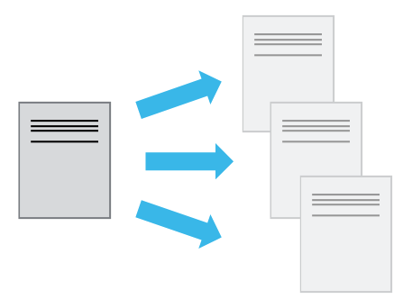

# Code management & collaboration

::left::

- *Version control* provides a full history of your project's software and other assets
- Makes for easy:
  - Backups
  - Collaboration
  - Recovering from dead-ends
- What should be in version control?
  - Code, documentation, tests, test data, analysis scripts
  - Reports, papers, etc.
- Packaging and deployment

::right::

::center

::

---

# Code management & collaboration

::centralise::

::center

<i>“If you’re not using version control, 
whatever else you might be doing with a computer, 
it’s not science."</i> 
 
Greg Wilson, SWC

::

---

# Version Control

- These skills will save you time
- Always assume others will use and develop your software
- Be clear on requirements and assume they will change
- Funders are increasingly expecting software outputs to be sustainable and reusable

---

# Version Control Systems

::centralise::

::center

  
  

::

---
layout: two-cols-header
---

# Version Control

::left::

- **Backup**
- Reproducibility
- Collaboration

::right::

---
layout: two-cols-header
---

# Version Control

::left::

- Backup
- **Reproducibility**
- Collaboration

::right::

---
layout: two-cols-header
---

# Version Control

::left::

- Backup
- Reproducibility
- **Collaboration**

::right::

---

# How do version control tools work?

- Start by storing the base version of the file
- After that, only changes are stored
- Like instructions for building lego

::centralise::

::center

::

---
layout: instruction
---

# Version control

::left::

::center
Making a commit
::

::right::

Instructor demo:
- Make change to a repository
- Stage, Commit using CLI
- Indicate git UI

---

# Git Branches + Feature Branch Workflow

Commit to main branch

Create a new branch, make commits to it

Changes independent of main branch

Merge commit

- Main branch for tested, stable code, feature branches for new, separate units of work
- Keeps main branch stable, allows independent work on features
- Easy to discard unwanted features

::center
 To change branches: `git checkout <branch_name>`
::

---

# Git Branches

::centralise::

::center

::

---
layout: instruction
---

# Version Control

::left::

::center

::

::right::

- Make a change, stage and commit to the main branch directly
- Create a feature branch
- Make a change, stage and commit to the feature branch
- Merge your feature branch back into main
