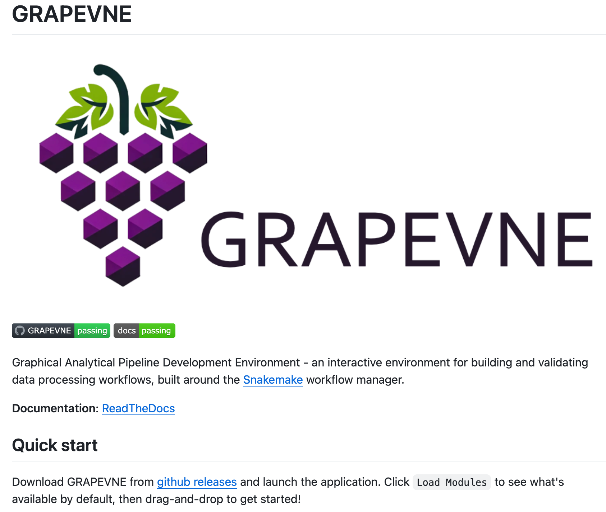

# Writing Clean Code
### Organise your file structure

::left::

```
Flat structure
├─ script.py
├─ image_1.jpg
├─ script_2.py
├─ utils.py
├─ image_1.png
├─ README.md
├─ image_2.png
├─ test_utils.py
├─ pyproject.toml
├─ notes.docx
├─ .gitignore
:
:
:
:
└─
```

::right::

<v-click>
```
Structured
├─ README.md
├─ pyproject.toml
├─ .gitignore
├─ src
│  ├─ script.py
│  ├─ script_2.py
│  └─ utils.py
├─ tests
│  └─ test_utils.py
├─ images
│  ├─ image_1.png
│  ├─ image_1.jpg
│  └─ image_2.png
├─ docs
│  └─ notes.docx
└─ dist
```
</v-click>

---
layout: "two-cols-header"
class: "gap-4"
---

# Writing Clean Code
### Use meaningful names

::left::

```python
def convert(x):
	return 32 + 1.8 * x
```

::right::

<v-click>
```python
def celsius_to_fahrenheit(celsius):
    return 32 + 1.8 * celsius
```
</v-click>

---

# Writing Clean Code
### Use consistent naming conventions

<div class="h-10" />

- Makes code more consistent (hence readable)
- Conventions are usually language-specific (e.g. [PEP 8](https://peps.python.org/pep-0008/))
    - Python typically uses `snake_case` for function and variable names
- Conventions can provide context
    - Python typically uses `PascalCase` for class names
- Conventions reduce arbitrary decision-making in code
- Conventions make code from different projects feel familiar
- Linters can help us adhere to language standards

<div class="absolute right-10 top-40 w-[20%] text-xl">
<pre><code>
camelCase
PascalCase
kebab-case
snake_case
</code></pre>
</div>

---

# Writing Clean Code
### Single responsibility principle

<div class="h-10" />

- Long functions conflate purpose, can easily introduce bugs
- Break long functions into smaller functions
- This often depends on the level of abstraction of the function
- Easier to replace smaller functions when new methods become available
- Rule of thumb: functions should not be too long

---
layout: two-cols-header
class: "items-center"
---

# Writing Clean Code
### Documentation

::left::

Instructions (README.md):
- Brief description of project
- How to install
- Preferably provide a minimal example

In code:
- Docstrings
- Annotations

::right::



---

# Writing Clean Code
### Documentation

<div class="h-10" />

Docstrings ([PEP-257](https://peps.python.org/pep-0257/))
- Single or multiline
- Can be applied to functions and classes
- Forms self-documenting code (`help(function_name)`)
- Often used to create (automatic) online documentation

---
layout: "two-cols-header"
---

# Writing Clean Code
### Documentation - docstrings

::left::

<div class="p-4">
```python
def celsius_to_fahrenheit(celsius):
	"""Convert celsius to Fahrenheit"""
	return 32 + 1.8 * celsius
```
</div>

::right::

<div class="p-4">
```python
> help(celsius_to_fahrenheit)

celsius_to_fahrenheit(celsius)
    Convert celsius to Fahrenheit
```
</div>

---
layout: "two-cols-header"
---

# Writing Clean Code
### Documentation - docstrings

::left::

<div class="p-4">
```python
def add3(a, b, c):
	"""Add three numbers

    A longer description of the
    function, if one is necessary.

	Params:
		a, b, c: numbers to add

	Returns:
		Sum of three numbers
	"""
	...
```
</div>

::right::

<div class="p-4">
```python
> help(add3)

add3(a, b, c)
	Add three numbers

    A longer description of the
    function, if one is necessary.

	Params:
		a, b, c: numbers to add

	Returns:
		Sum of three numbers
```
</div>

---

# Writing Clean Code
### Documentation - annotations


<br>

<div class="flex justify-center">
    <div class="w-3/4 p-4">
A not so useful example:

```python
# Read data from file
data = read_data(filename)

# Calculate word count and add 10
word_count = calculate_word_count(data)
word_count = word_count + 10

# Print final word count
print(word_count)
```
    </div>
</div>

---

# Writing Clean Code
### Documentation - annotations

<div class="flex justify-center">
    <div class="w-3/4 p-4">
<br>
Real world example (useful):

```python
# we don't use path.splitext to also handle extensions like .cdt.dpa
filename, ext = filepath.split(".", maxsplit=1)
```
    </div>
</div>

<br>

::: center

<v-click>
Don’t state <b>what</b> <i>(the code already tells us that)</i><br>
explain <b>why</b> <i>(provide context)</i>
</v-click>

:::

---

# Documentation

### Linters
- Compares your code to a standard (e.g. PEP)
- Identifies programming errors, bugs, stylistic errors

<div class="h-5" />

### Auto-formatters
- Applies stylistic conventions, e.g.
  ```python
  dict.get(v1+v2*dict[‘key’])
  ```
    becomes
  ```python
  dict.get(v1 + v2 * dict["key"])
             ^ ^  ^ ^     ^   ^
  ```
- Saves time
- You don’t have to worry about remembering all of the rules
- Reduces decision making

<div class="absolute top-25 right-10 w-[30%] border">
Ruff can do both:
<ul>
<li><code>pip install ruff</code></li>
<li>Linter: <code>ruff check</code></li>
<li>Auto-formatter: <code>ruff format</code></li>
</ul>
</div>

---

# Recording computational steps

<div class="h-10" />

**A comment on workspaces in JuPyter / Matlab / R:**
- A script / program records a series of computational steps
- Workspaces are designed to resume previous sessions (persistent state)
- This can introduce manual steps that are <span v-mark.underline.orange="1">not recorded</span>, making it <span v-mark.underline.red="2">impossible to reproduce</span> the previous result(s)

**Regularly 'run from the top'**
- Select 'Rull All' cells or the equivalent when you start work for the day
- Fix any problems before you continue creating
- If it doesn't take long to run, _always_ run all cells

---
layout: instruction
---

# Exercise

::left::

::center
Explore and organise the repository
::

::right::

Get the linter to pass!
- Run a linter on the project to identify issues - try to resolve a few by hand
- Run an auto-formatter on the project to provide style consistency

Further improvements:
- Add docstrings to functions
- Organise the file structure
- Use meaningful names
- Consistent naming conventions
- Single Responsibility Principle
