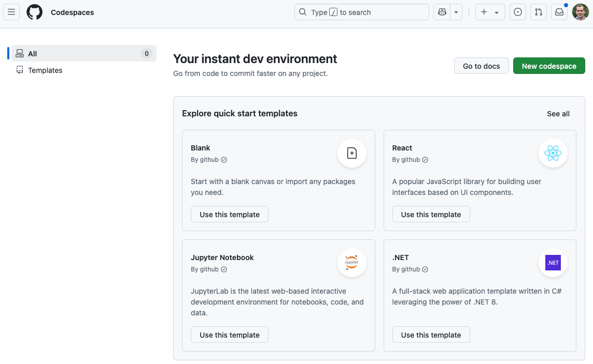
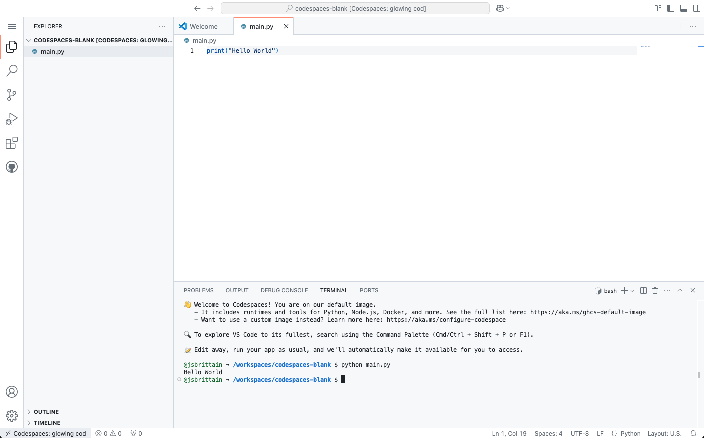
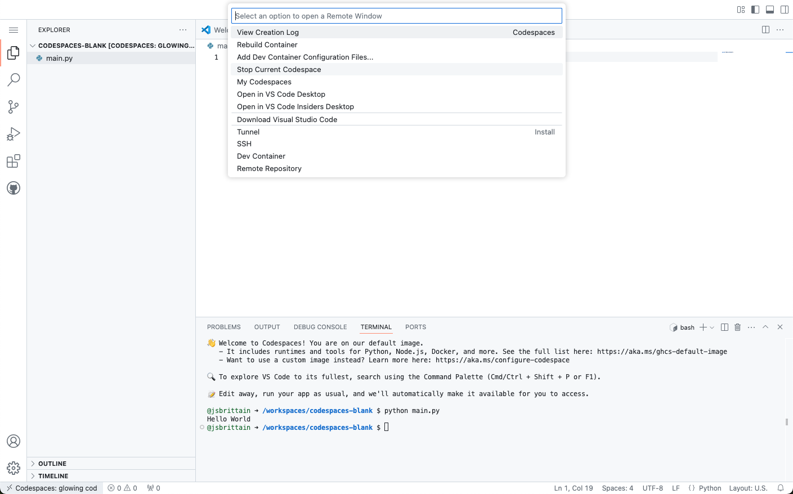

# Start your codespaces...

::left::



::right::

Navigate to https://github.com/codespaces

Under **Blank** select **Use this template**

---
layout: instruction
---

# Try using Python...

::left::



::right::

Wait for your codespace to load

Select **New File** and call it `main.py`

Populate the file with:
::center
```python
print(“Hello World”)
```
::

Run from the terminal:
::center
```bash
python main.py
```
::

---
layout: instruction
---

# Stopping your codespace

::left::



::right::

Select **Codespaces**

Select **Stop Current Codespace**
