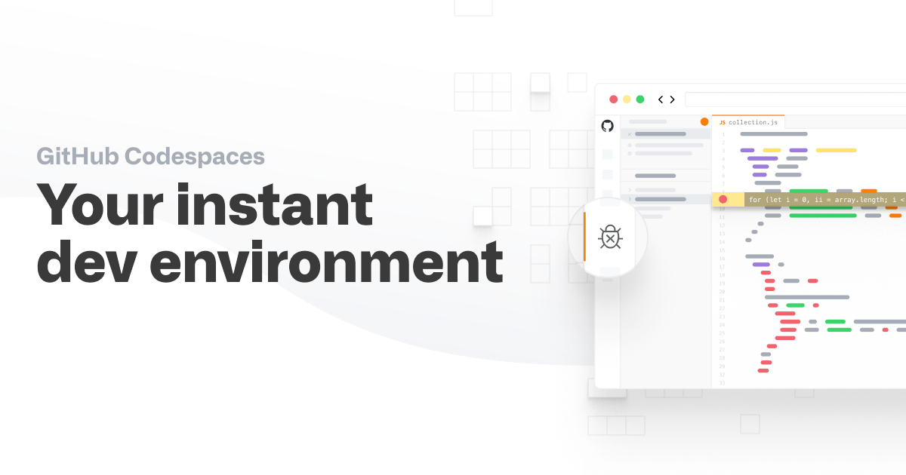

# Codespaces

::centralise::

::center

 
<Link to="working-in-your-own-environment" title="Working in your own environment" />

::

<!--
codespaces - we will think of them as running on your local machine.

not advocate as main development platform

github pro gives more minutes
Free GitHub Pro account for verified learners
https://github.com/education/students
https://github.com/education/teachers

-->

