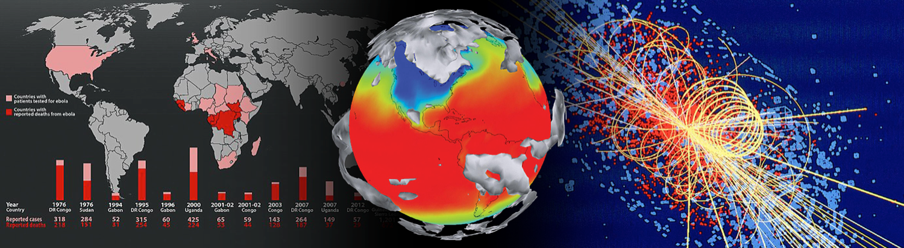
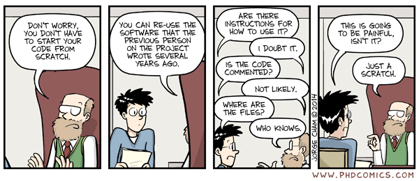
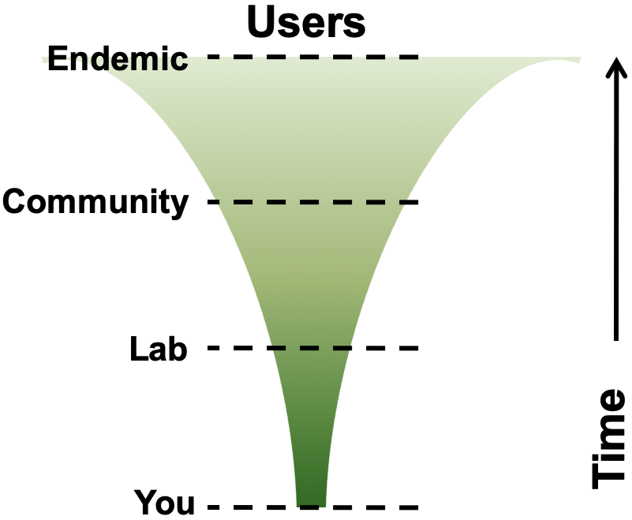

::centralise::

# Why engineer research software?

---

# Research is impossible without software

::centralise::

From thrown-together scripts, through an abundance of complex spreadsheets, to the millions of lines of code behind large-scale infrastructure, there are few areas where software does not play a fundamental part in research

<!--
‘Not MY software’... ‘Doesnt affect my scripts on my desktop’ lets think about what the lifecycle of those scripts are…

Your software (experiments, analysis, meta analyses, visualisation) produces the results for articles from your lab

Articles are picked up by news agencies and government policy advisories to shape public opinion and government policy

Need to ensure transparency, reproducibility, potential for expansion and collaboration, correctness

Quite scary - suddenly a great emphasis on your code; you want it to be correct, you need it to be well documented.. Or even yourself in 6 months when your writing up

Make life easy for yourself NOW and strcutreu your code
-->

---
transition: "none"
---

# Idealised research software lifecycle

::centralise::

::center

  <!-- Cascading boxes -->
  

    Research Questions
  

  

    Develop Software
  

  

    Run Software
  

  

    Analyse Data
  

  

    Publish Paper
  

  

    Project Ends
  

  <FancyArrow x1="20" y1="40" x2="60" y2="84" arc="-0.4" head-size="15" />
  <FancyArrow x1="85" y1="105" x2="125" y2="150" arc="-0.4" head-size="15" />
  <FancyArrow x1="150" y1="170" x2="190" y2="212" arc="-0.4" head-size="15" />
  <FancyArrow x1="210" y1="230" x2="255" y2="275" arc="-0.4" head-size="15" />
  <FancyArrow x1="270" y1="295" x2="320" y2="340" arc="-0.4" head-size="15" />

::

<!--
Highly unrealistic; also treats software developed as disposable; software increasingly DEMANDED to be open access published by journals, reproduce your results

Understandable… there has been a crisis in confidence of the publishing model - the reproducilbiity crisis;
-->

---

# In reality...

::centralise::

::center

  <!-- Cascading boxes -->
  

    Research Questions
  

  

    Develop Software
  

  

    Run Software
  

  

    Analyse Data
  

  

    Publish Paper
  

  

    Project Ends
  

  
  

    Graceful Decline
  

  <!-- Forward paths -->
  <FancyArrow x1="20" y1="40" x2="60" y2="84" arc="-0.4" head-size="15" />
  <FancyArrow x1="85" y1="105" x2="125" y2="150" arc="-0.4" head-size="15" />
  <FancyArrow x1="150" y1="170" x2="190" y2="212" arc="-0.4" head-size="15" />
  <FancyArrow x1="210" y1="230" x2="255" y2="275" arc="-0.4" head-size="15" />
  <FancyArrow x1="270" y1="295" x2="320" y2="340" arc="-0.4" head-size="15" />
  <FancyArrow x1="462" y1="340" x2="517" y2="340" head-size="15" />

  

    Project Partners
  

  

    Industry
  

  

    Other People
  

  <!-- Project partners -->
  <FancyArrow x1="-70" y1="155" x2="-5" y2="15" arc="0.4" head-size="15" color="gray" />
  <FancyArrow x1="-40" y1="200" x2="125" y2="150" arc="-0.3" head-size="15" color="gray"/>
  <FancyArrow x1="-70" y1="155" x2="60" y2="84" arc="0.4" head-size="15" color="gray"/>
  <FancyArrow x1="-40" y1="200" x2="190" y2="212" arc="-0.2" head-size="15" color="gray"/>

  <!-- Industry -->
  <FancyArrow x1="0" y1="235" x2="-5" y2="15" arc="0.4" head-size="15" color="gray"/>
  <FancyArrow x1="0" y1="235" x2="125" y2="150" arc="-0.3" head-size="15" color="gray"/>
  <FancyArrow x1="0" y1="235" x2="60" y2="84" arc="0.4" head-size="15" color="gray"/>
  <FancyArrow x1="60" y1="260" x2="190" y2="212" arc="-0.2" head-size="15" color="gray"/>

  <!-- Other people -->
  <FancyArrow x1="120" y1="320" x2="-5" y2="15" arc="0.4" head-size="15" color="gray"/>
  <FancyArrow x1="120" y1="320" x2="125" y2="150" arc="-0.3" head-size="15" color="gray"/>
  <FancyArrow x1="120" y1="320" x2="60" y2="84" arc="0.4" head-size="15" color="gray"/>
  <FancyArrow x1="120" y1="320" x2="190" y2="212" arc="-0.2" head-size="15" color="gray"/>

  <!-- Backpaths -->
  <FancyArrow x1="430" y1="315" x2="205" y2="15" arc="-0.4" head-size="15" color="gray"/>
  <FancyArrow x1="370" y1="250" x2="205" y2="15" arc="-0.4" head-size="15" color="gray"/>
  <FancyArrow x1="370" y1="250" x2="250" y2="80" arc="-0.4" head-size="15" color="gray"/>
  <FancyArrow x1="300" y1="190" x2="250" y2="80" arc="-0.4" head-size="15" color="gray"/>
  <FancyArrow x1="300" y1="190" x2="205" y2="15" arc="-0.4" head-size="15" color="gray"/>
  <FancyArrow x1="250" y1="125" x2="250" y2="80" arc="-0.4" head-size="15" color="gray"/>
  <FancyArrow x1="85" y1="105" x2="255" y2="275" arc="-0.4" head-size="15" color="gray"/>

  What happens when…
  <ul>
  <li>You have a follow-on project?</li>
  <li>Someone else wants to use your code?</li>
  <li>Someone wants to reproduce your results?</li>
  </ul>

  When should you have considered how to engineer your software?

::

<!--
Project partners: MSc, undergrad, different version of software

End of process of continual iteration we publish a paper; even then the software doesnt die, supports the lab for the next 5-10 years in various guises.
-->

---

# Legacy code

::center

::

<v-clicks at="0" every="2">

- What are your experiences re-running or adjusting a script you created few months ago?
- Have you continued working from a previous student's code?
- Are you afraid to alter existing code for fear of it breaking?

</v-clicks>

---

# The software you write is important!

::centralise::

- Software inherently contains value
  - Produces results, contains lessons learnt, effort

- Difficult to gauge to what extent it might be used in the future
  - By who?
  - Which parts?
  - Which projects?
  - Reproducibility – from publications!

Can it / should it be reusable by others... including yourself?

  

